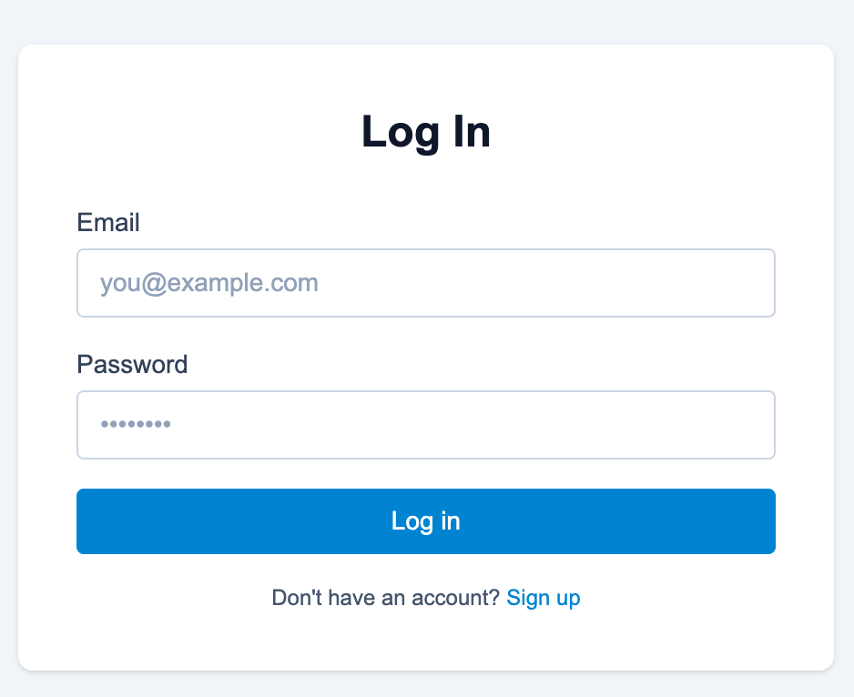
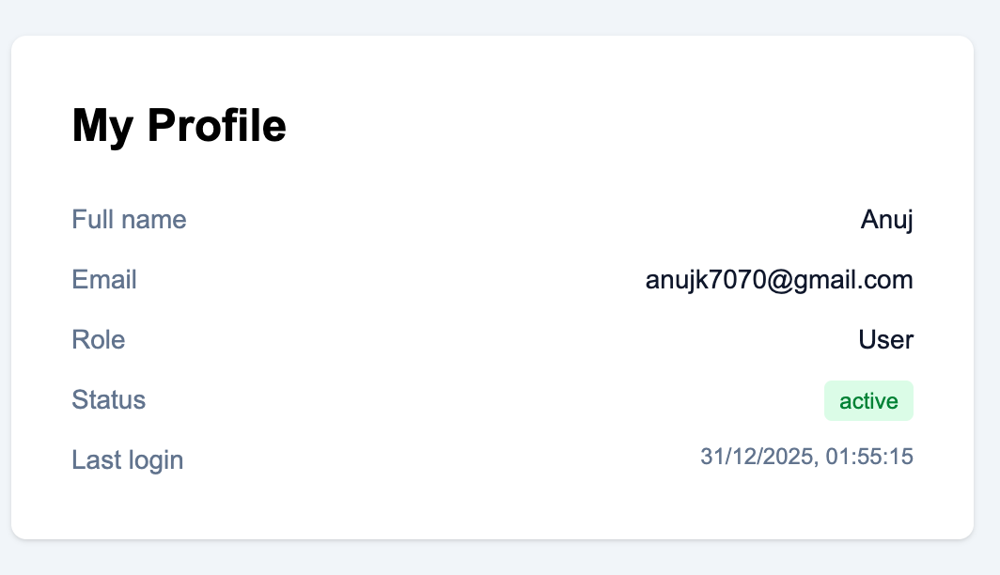
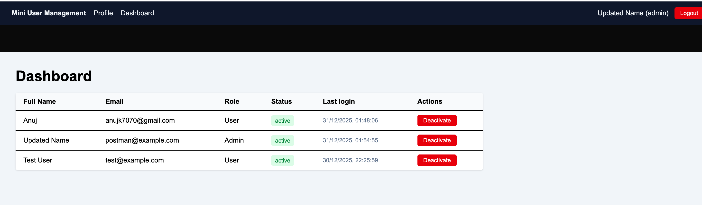

# Mini User Management System

Full-stack user management app with authentication, authorization, and basic admin controls.

## Tech Stack

- **Backend**: Node.js, Express, TypeScript, MongoDB, JWT  
- **Frontend**: Next.js 16 (App Router), TypeScript, Tailwind CSS  

## Quick Start

### Backend

- Base URL: `http://localhost:4000`
- Typical commands:
  - `npm install`
  - `npm run dev` (or your existing dev script)

### Frontend

- Base URL: `http://localhost:3000`
- Typical commands:
  - `npm install`
  - `npm run dev`

Make sure the frontend `.env` includes:http://localhost:4000

so the client can call the API correctly.

## Implemented API Endpoints

### Auth

| Method | Endpoint           | Description             | Auth |
|--------|--------------------|-------------------------|------|
| POST   | `/api/auth/signup` | Create new user         | No   |
| POST   | `/api/auth/login`  | Login and get JWT      | No   |
| GET    | `/api/auth/me`     | Get current user       | Yes  |
| POST   | `/api/auth/logout` | Logout current user    | Yes  |

### Admin (User Management)

> Mounted under `/api` with admin-only middleware.

| Method | Endpoint                           | Description                     | Auth        |
|--------|------------------------------------|---------------------------------|------------|
| GET    | `/api/users?page=1`               | List users (paginated support)  | Admin only |
| PATCH  | `/api/users/:id/activate`         | Activate a user                 | Admin only |
| PATCH  | `/api/users/:id/deactivate`       | Deactivate a user               | Admin only |

> Adjust the table above if you later change paths to `/api/admin/users` or to a single `/status` endpoint.

## Frontend Routes & Behavior

### Public

- `/login`  
  - Email + password login.  
  - On success, stores JWT token and user in `localStorage`.  
  - Redirects:
    - Admin → `/dashboard`
    - Normal user → `/profile`  
  - Footer link: “Don’t have an account? Sign up”.

- `/signup`  
  - Fields: full name, email, password, confirm password.  
  - Client-side checks:
    - Password length (min 8 characters).
    - Confirm password must match.  
  - On success, redirects to `/login`.  
  - Footer link: “Already have an account? Log in”.

### Protected

- `/profile` (user and admin)  
  - Requires JWT in `localStorage`.  
  - Fetches `/api/auth/me` to show current user details (name, email, role, status, last login).  
  - If no token, redirects to `/login`.

- `/dashboard` (admin only)  
  - Requires JWT and `role: "admin"`.  
  - If not authenticated → redirects to `/login`.  
  - If authenticated but role ≠ admin → redirects to `/profile`.  
  - Shows:
    - Paginated user table (name, email, role, status, last login).
    - Buttons to **Activate** or **Deactivate** users using the admin endpoints.

### Layout & Navbar

- Global `Navbar` shows when a user is logged in:
  - App title.
  - Link to **Profile** (all users).
  - Link to **Dashboard** (admins only).
  - Current user’s name and role.
  - **Logout** button:
    - Calls `POST /api/auth/logout`.
    - Clears token and user from `localStorage`.
    - Redirects to `/login`.

- The main layout adds top padding under the navbar so login and signup cards are clearly visible.

## Features

- JWT authentication with role-based access control (user vs admin).
- Login and signup flows with client-side validation.
- Protected routes (profile and admin dashboard).
- Admin dashboard for:
  - Viewing users with status and last login.
  - Activating/deactivating users.
- Responsive UI built with Tailwind CSS.

> Note: Profile update and password change endpoints/UI are **not** implemented yet; if you add them later, extend this README accordingly.

## How to Test

1. **Sign up** a new user via `/signup`.  
2. **Log in** via `/login`:
   - Confirm redirect:
     - If the user has role `admin`, you land on `/dashboard`.
     - If the user has role `user`, you land on `/profile`.
3. **Admin dashboard**:
   - Log in as an admin user.
   - Visit `/dashboard` to:
     - See the user list.
     - Activate/deactivate users.
4. **Access protection**:
   - Visit `/profile` and `/dashboard` without logging in:
     - You should be redirected to `/login`.
   - Log in as a normal user and try `/dashboard`:
     - You should be redirected to `/profile`.

## Screenshots  

 

- **Login Page**  

- **Signup Page**  
 

- **Profile Page**  

- **Admin Dashboard**  

 

